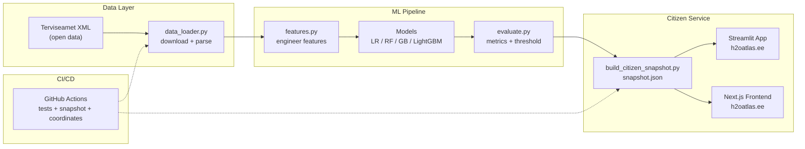

<div align="center">
  

  # Water Quality Estonia

  **Probabilistic risk estimator for water quality compliance**\
  *TalTech Machine Learning course project (Masinope, spring 2026)*

  [](https://github.com/sapsan14/water-quality-ee/actions/workflows/tests.yml)
  [](https://github.com/sapsan14/water-quality-ee/actions/workflows/frontend-ci.yml)
  [](https://www.python.org/downloads/)
  [](LICENSE)
  [](https://docs.astral.sh/ruff/)

  [](https://scikit-learn.org/)
  [](https://lightgbm.readthedocs.io/)
  [](https://nextjs.org/)
  [](https://streamlit.io/)
  [](https://jupyter.org/)

  [](https://vtiav.sm.ee/index.php/?active_tab_id=A)
  [](https://h2oatlas.ee)
  [](https://colab.research.google.com/github/sapsan14/water-quality-ee/blob/main/notebooks/colab_quickstart.ipynb)

  **[English]** | [Русский](README.ru.md)

</div>

---

## Overview

Estonia has thousands of monitored water sites: coastal and inland swimming locations, public pools and SPAs, drinking water networks, and natural water sources. The national Health Board ([Terviseamet](https://vtiav.sm.ee)) publishes laboratory analysis results as open data.

This project builds a **binary classification model** that estimates **P(violation)** -- the probability that a water sample violates Estonian health norms -- based on 15 chemical and biological parameters plus engineered features. The model is trained on **69,536 samples** across four water domains (2021-2026).

> **What the model predicts:** probability that a sample's measurement profile matches historical violation patterns.\
> **What it does NOT predict:** unmeasured contaminants, future water quality, causal reasons for contamination, or safety beyond the measured parameters.\
> Full analysis: [`docs/ml_framing.md`](docs/ml_framing.md)

### Key Results

| Model | Recall (violations) | Precision | F1 | ROC-AUC |
|-------|--------------------:|----------:|---:|--------:|
| Logistic Regression | 0.827 | 0.454 | 0.586 | 0.936 |
| Random Forest | 0.949 | 0.919 | 0.934 | 0.992 |
| Gradient Boosting | 0.954 | 0.946 | 0.950 | 0.994 |
| **LightGBM (temporal)** | **0.956** | **0.881** | **0.917** | **0.988** |

**Priority metric: Recall on violations** -- a False Negative means predicting water is safe when it contains E. coli. Threshold is optimized via `best_threshold_max_recall_at_precision()` for decision support. Full report: [`docs/report.md`](docs/report.md)

### Live Demo

**[h2oatlas.ee](https://h2oatlas.ee)** -- interactive map of per-location water quality with two layers: **official Terviseamet status** and **ML risk assessment** (P(violation) from 4 models). Supports three languages (RU/ET/EN), dark mode, and mobile-first responsive design.

---

## Table of Contents

- [Quick Start](#quick-start)
- [Project Structure](#project-structure)
- [Data](#data)
- [Notebooks](#notebooks)
- [Models & Evaluation](#models--evaluation)
- [Citizen Service & Frontend](#citizen-service--frontend)
- [Architecture](#architecture)
- [Documentation](#documentation)
- [Google Colab](#google-colab)
- [Tests](#tests)
- [Course Requirements](#course-requirements)
- [License](#license)
- [Citation](#citation)
- [Acknowledgments](#acknowledgments)

---

## Quick Start

```bash
# 1. Install
pip install -r requirements.txt
pip install -e .                  # editable install: imports work from any cwd

# 2. Download & parse open data
python src/data_loader.py         # downloads XML, caches to data/raw/, prints sample

# 3. Run notebooks
jupyter notebook                  # open notebooks/01_eda_supluskoha.ipynb
```

**Requirements:** Python 3.10+ (3.11+ recommended). For LightGBM + SHAP: `pip install lightgbm shap`.

---

## Project Structure

```
water-quality-ee/
├── src/                           # Core Python modules
│   ├── data_loader.py             #   XML download, parsing, domain loaders
│   ├── features.py                #   Feature engineering, ratio-to-norm, imputation
│   ├── evaluate.py                #   Metrics, ROC, threshold optimization, SHAP
│   ├── county_infer.py            #   Location -> county inference + geocoding
│   ├── terviseamet_reference_coords.py  # Official coordinate mappings
│   └── audit/                     #   Data quality validation modules
│
├── notebooks/                     # Jupyter notebooks (run 01 -> 07 in order)
│   ├── colab_quickstart.ipynb     #   Google Colab setup
│   ├── 01_eda_supluskoha.ipynb    #   EDA: swimming locations
│   ├── 02_eda_full.ipynb          #   EDA: all four domains
│   ├── 03_preprocessing.ipynb     #   Feature engineering, train/test split
│   ├── 04_models.ipynb            #   LR + RF + GB + GridSearchCV
│   ├── 05_evaluation.ipynb        #   Confusion matrix, ROC, feature importance
│   ├── 06_advanced_models.ipynb   #   LightGBM, temporal split, calibration, SHAP
│   └── 07_data_gaps_audit.ipynb   #   Label-vs-norms divergence analysis
│
├── citizen-service/               # Streamlit app (h2oatlas.ee backend)
│   ├── app/streamlit_app.py       #   Interactive map + table UI
│   └── scripts/                   #   Snapshot builder, coordinate enrichment
│
├── frontend/                      # Next.js 16 + React 19 + TypeScript
│   ├── app/                       #   App Router components
│   └── public/                    #   Logo, favicon, snapshot data
│
├── tests/                         # pytest test suite (10 modules)
├── docs/                          # Project documentation (19 files)
├── data/                          # Local data (raw XML, processed, reference)
│
├── pyproject.toml                 # Package metadata
├── requirements.txt               # Python dependencies
├── CITATION.cff                   # Academic citation
├── LICENSE                        # MIT License
└── DATA_SOURCES.md                # Comprehensive data source catalog
```

---

## Data

**Source:** [Terviseamet](https://vtiav.sm.ee/index.php/?active_tab_id=A) (Estonian Health Board) open data -- XML format, 2021-2026.

| Domain | Estonian | Description | Samples |
|--------|---------|-------------|--------:|
| `supluskoha` | Supluskohad | Swimming locations (sea, lakes) | ~4,000 |
| `veevark` | Veevargid | Drinking water networks | ~45,000 |
| `basseinid` | Basseinid | Swimming pools & SPAs | ~10,000 |
| `joogivesi` | Joogiveeallikad | Drinking water sources | ~10,000 |

**15 measured parameters:** E. coli, enterococci, coliforms, pH, turbidity, color, iron, manganese, nitrates, nitrites, ammonium, fluoride, free chlorine, combined chlorine, pseudomonas. Full descriptions: [`docs/parametry.md`](docs/parametry.md)

**Key conventions:**
- `compliant` = 1 (passes norms) or 0 (violation); derived from Terviseamet `hinnang` field
- `location_key` -- normalized location identifier; always use instead of raw `location` (handles inter-year renaming). See [`src/data_loader.py`](src/data_loader.py)
- Estonian number format (comma as decimal separator) handled automatically in the parser

Full data documentation: [`DATA_SOURCES.md`](DATA_SOURCES.md)

---

## Notebooks

Notebooks are numbered sequentially and should be run in order:

| # | Notebook | Purpose |
|---|----------|---------|
| 00 | [`polnoye_rukovodstvo`](notebooks/00_polnoye_rukovodstvo.ipynb) | End-to-end walkthrough (optional) |
| 01 | [`eda_supluskoha`](notebooks/01_eda_supluskoha.ipynb) | EDA for swimming locations |
| 02 | [`eda_full`](notebooks/02_eda_full.ipynb) | Full EDA across all four domains |
| 03 | [`preprocessing`](notebooks/03_preprocessing.ipynb) | `build_dataset`, train/test split, impute/scale |
| 04 | [`models`](notebooks/04_models.ipynb) | LR + RF + GradientBoosting + GridSearchCV |
| 05 | [`evaluation`](notebooks/05_evaluation.ipynb) | Confusion matrix, ROC, feature importance |
| 06 | [`advanced_models`](notebooks/06_advanced_models.ipynb) | LightGBM + temporal split + calibration + SHAP |
| 07 | [`data_gaps_audit`](notebooks/07_data_gaps_audit.ipynb) | Label-vs-norms divergence analysis |

---

## Models & Evaluation

**Task:** Binary classification -- `compliant` (1 = pass, 0 = violation)\
**Class imbalance:** ~12% violations across the full corpus\
**Priority:** Minimize False Negatives (FN = "predicted safe, actually contaminated")

Four models are trained and compared:

1. **Logistic Regression** -- interpretable baseline
2. **Random Forest** -- primary model, feature importance
3. **Gradient Boosting** (sklearn) -- high-accuracy ensemble
4. **LightGBM** -- best model: native missing-value handling, temporal split validation, SHAP explanations

**Evaluation framework (4 levels):**

| Level | Question | Metric |
|:-----:|----------|--------|
| 1 | Does the model separate classes? | ROC-AUC |
| 2 | What types of errors? | Precision / Recall |
| 3 | Are probabilities calibrated? | Calibration curve |
| 4 | Why this prediction? | SHAP values |

Full metrics guide: [`docs/ml_metrics_guide.md`](docs/ml_metrics_guide.md)

---

## Citizen Service & Frontend

The project includes a public citizen-facing service deployed at **[h2oatlas.ee](https://h2oatlas.ee)**:

- **Two information layers:** official Terviseamet compliance status + ML risk assessment (P(violation) from 4 models)
- **Interactive map** with Leaflet clustering, domain-specific icons, and county boundaries
- **Per-location detail:** latest sample, measurements, history, parameter explanations, SHAP-based risk factors
- **Three languages:** Russian, Estonian, English (auto-detected + user toggle)
- **Dark mode** with system preference detection and localStorage persistence
- **Mobile-first** responsive design (bottom sheet, safe-area insets, touch-optimized)

| Component | Stack | Deployment |
|-----------|-------|------------|
| Data pipeline | Python + GitHub Actions (scheduled) | CI/CD |
| Map backend | Streamlit | Streamlit Cloud |
| Web frontend | Next.js 16 + React 19 + TypeScript | Cloudflare Pages |

Documentation: [`citizen-service/README.md`](citizen-service/README.md) | [`frontend/README.md`](frontend/README.md)

---

## Architecture



---

## Documentation

| Document | Description |
|----------|-------------|
| [`docs/report.md`](docs/report.md) | Final course report: EDA, methodology, results, limitations |
| [`docs/ml_framing.md`](docs/ml_framing.md) | What the model predicts vs. what it cannot |
| [`docs/ml_metrics_guide.md`](docs/ml_metrics_guide.md) | 4-level metrics guide: ROC-AUC, Precision/Recall, Calibration, SHAP |
| [`docs/parametry.md`](docs/parametry.md) | Water parameter descriptions, health effects, norms |
| [`docs/normy.md`](docs/normy.md) | Regulatory thresholds by parameter and domain |
| [`docs/glosarij.md`](docs/glosarij.md) | Terminology glossary (RU / ET / EN) |
| [`docs/learning_journey.md`](docs/learning_journey.md) | Project learning narrative and discoveries |
| [`docs/phase_10_findings.md`](docs/phase_10_findings.md) | Data-quality audit results (69,536 samples) |
| [`docs/data_gaps.md`](docs/data_gaps.md) | Label-vs-norms divergence analysis |
| [`docs/terviseamet_inquiry.md`](docs/terviseamet_inquiry.md) | Draft inquiry to Terviseamet (with audit numbers) |
| [`DATA_SOURCES.md`](DATA_SOURCES.md) | Comprehensive data source catalog |

---

## Google Colab

Use **[`notebooks/colab_quickstart.ipynb`](https://colab.research.google.com/github/sapsan14/water-quality-ee/blob/main/notebooks/colab_quickstart.ipynb)** to run the project in the cloud:

1. Set `REPO_URL`, run clone + `pip install -r requirements.txt` + `pip install -e .`
2. Open notebooks `01` through `07` from the file browser
3. For notebook `06`: additionally install `lightgbm` and `shap`

Note: scikit-learn models do **not** use GPU. Colab T4 runtime won't accelerate LR/RF/GB.

---

## Tests

```bash
pip install -e . pytest && pytest tests/
```

10 test modules covering XML parsing, feature engineering, threshold optimization, geocoding, coordinate resolution, and data quality audits. CI runs automatically on push/PR via [`.github/workflows/tests.yml`](.github/workflows/tests.yml).

---

## Course Requirements

TalTech Masinope (Machine Learning) -- all required components:

- [x] Problem statement and dataset rationale
- [x] Exploratory data analysis with visualization
- [x] Data preprocessing and feature engineering
- [x] Training of 2+ models with hyperparameter tuning
- [x] Metric comparison and model selection
- [x] Result interpretation (SHAP, feature importance)
- [x] Final report and presentation

---

## License

This project is licensed under the [MIT License](LICENSE).

---

## Citation

If you use this software or data pipeline in your research, please cite:

```bibtex
@software{sokolov2026waterquality,
  author    = {Sokolov, Anton},
  title     = {Water Quality Estonia: Probabilistic Risk Estimator},
  year      = {2026},
  url       = {https://github.com/sapsan14/water-quality-ee},
  version   = {0.1.0},
  note      = {TalTech Masinope course project}
}
```

See [`CITATION.cff`](CITATION.cff) for machine-readable citation metadata.

---

## Acknowledgments

- **[Terviseamet](https://vtiav.sm.ee)** (Estonian Health Board) -- open data provider
- **[Tallinn University of Technology](https://taltech.ee)** -- Masinope (Machine Learning) course, spring 2026
- **Estonian open data initiative** -- making government data accessible for research and public benefit

---

<div align="center">
  <sub>Built with care for Estonian water safety</sub>
</div>
