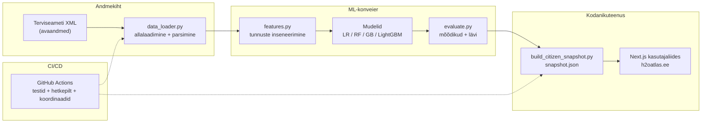

<div align="center">
  

  # Eesti vee kvaliteet

  **Tõenäosuslik riskihinnang vee kvaliteedi nõuetele vastavuse kohta**\
  *TalTech [Masinõppe rakendamine tehniliste erialade spetsialistidele](https://taltech.ee/masinope_inseneridele) kursuseprojekt, kevad 2026*

  [](https://github.com/sapsan14/water-quality-ee/actions/workflows/tests.yml)
  [](https://github.com/sapsan14/water-quality-ee/actions/workflows/frontend-ci.yml)
  [](https://www.python.org/downloads/)
  [](LICENSE)
  [](https://docs.astral.sh/ruff/)

  [](https://scikit-learn.org/)
  [](https://lightgbm.readthedocs.io/)
  [](https://nextjs.org/)
  [](https://jupyter.org/)

  [](https://vtiav.sm.ee/index.php/?active_tab_id=A)
  [](https://h2oatlas.ee)
  [](https://colab.research.google.com/github/sapsan14/water-quality-ee/blob/main/notebooks/colab_quickstart.ipynb)

  **[Eesti]** | [English](README.en.md) | [Русский](README.ru.md)

</div>

---

## Ülevaade

Eestis on tuhandeid seiratavaid veekohti: ranniku- ja sisemaa supelkohad, avalikud basseinid ja spaad, joogivee võrgud ning looduslikud veeallikad. Terviseamet avaldab laborianalüüside tulemused avatud andmetena.

See projekt loob **binaarse klassifitseerimismudeli**, mis hindab **P(rikkumine)** — tõenäosust, et veeproov rikub Eesti tervisenorme — 15 keemilise ja bioloogilise parameetri ning inseneritud tunnuste põhjal. Mudel on treenitud **69 536 proovil** neljast veedomeenist (2021–2026).

> **Mida mudel ennustab:** tõenäosus, et proovi mõõtmisprofiil vastab ajaloolistele rikkumismustritele.\
> **Mida mudel EI ennusta:** mõõtmata saasteaineid, tulevast vee kvaliteeti, saastumise põhjuseid ega ohutust mõõdetud parameetritest väljaspool.\
> Täisanalüüs: [`docs/ml_framing.md`](docs/ml_framing.md)

### Peamised tulemused

| Mudel | Saagis (rikkumised) | Täpsus | F1 | ROC-AUC |
|-------|--------------------:|-------:|---:|--------:|
| Logistiline regressioon | 0,827 | 0,454 | 0,586 | 0,936 |
| Juhuslik mets | 0,949 | 0,919 | 0,934 | 0,992 |
| Gradient Boosting | 0,954 | 0,946 | 0,950 | 0,994 |
| **LightGBM (temporaalne)** | **0,956** | **0,881** | **0,917** | **0,988** |

**Prioriteetne mõõdik: rikkumiste saagis** — valepositiivne tähendab, et vesi tunnistatakse ohutuks, kuigi see sisaldab E. coli't. Lävi on optimeeritud funktsiooni `best_threshold_max_recall_at_precision()` abil otsustustoe jaoks. Täisraport: [`docs/report.md`](docs/report.md)

### Elav demo

**[h2oatlas.ee](https://h2oatlas.ee)** — interaktiivne kaart asukohtade vee kvaliteediga kahes kihis: **Terviseameti ametlik staatus** ja **ML-riskihinnang** (P(rikkumine) 4 mudelilt). Toetab kolme keelt (RU/ET/EN), tumedat režiimi ja mobiilisõbralikku disaini.

---

## Sisukord

- [Kiirstart](#kiirstart)
- [Projekti struktuur](#projekti-struktuur)
- [Andmed](#andmed)
- [Märkmikud](#märkmikud)
- [Mudelid ja hindamine](#mudelid-ja-hindamine)
- [Kodanikuteenus ja kasutajaliides](#kodanikuteenus-ja-kasutajaliides)
- [Arhitektuur](#arhitektuur)
- [Dokumentatsioon](#dokumentatsioon)
- [Google Colab](#google-colab)
- [Testid](#testid)
- [Kursusenõuded](#kursusenõuded)
- [Litsents](#litsents)
- [Tsiteerimine](#tsiteerimine)
- [Tänuavaldused](#tänuavaldused)

---

## Kiirstart

```bash
# 1. Paigaldamine
pip install -r requirements.txt
pip install -e .                  # redigeeritav paigaldus: import töötab igast kaustast

# 2. Avaandmete allalaadimine ja parsimine
python src/data_loader.py         # laeb XML-i alla, salvestab data/raw/ kausta, prindib näidise

# 3. Märkmike käivitamine
jupyter notebook                  # ava notebooks/01_eda_supluskoha.ipynb
```

**Nõuded:** Python 3.10+ (soovituslik 3.11+). LightGBM + SHAP jaoks: `pip install lightgbm shap`.

---

## Projekti struktuur

```
water-quality-ee/
├── src/                           # Põhilised Pythoni moodulid
│   ├── data_loader.py             #   XML-i allalaadimine, parsimine, domeenilaadijad
│   ├── features.py                #   Tunnuste inseneerimine, normiga suhtarv, imputeerimine
│   ├── evaluate.py                #   Mõõdikud, ROC, läve optimeerimine, SHAP
│   ├── county_infer.py            #   Asukoht -> maakonna tuletamine + geokodeerimine
│   ├── terviseamet_reference_coords.py  # Ametlikud koordinaatide vastendused
│   └── audit/                     #   Andmekvaliteedi valideerimismoodulid
│
├── notebooks/                     # Jupyteri märkmikud (käivita järjekorras 01 -> 07)
│   ├── colab_quickstart.ipynb     #   Google Colabi seadistamine
│   ├── 01_eda_supluskoha.ipynb    #   EDA: supelkohad
│   ├── 02_eda_full.ipynb          #   EDA: kõik neli domeeni
│   ├── 03_preprocessing.ipynb     #   Tunnuste inseneerimine, treening/test jaotus
│   ├── 04_models.ipynb            #   LR + RF + GB + GridSearchCV
│   ├── 05_evaluation.ipynb        #   Segadusmaatriks, ROC, tunnuste olulisus
│   ├── 06_advanced_models.ipynb   #   LightGBM, temporaalne jaotus, kalibreerimine, SHAP
│   └── 07_data_gaps_audit.ipynb   #   Märgise ja normide lahknevuse analüüs
│
├── citizen-service/               # Andmekonveier (h2oatlas.ee taustaosa)
│   └── scripts/                   #   Hetkepildi koostaja, koordinaatide rikastamine
│
├── frontend/                      # Next.js 16 + React 19 + TypeScript
│   ├── app/                       #   App Routeri komponendid
│   └── public/                    #   Logo, favicon, hetkepildi andmed
│
├── tests/                         # pytesti testikomplekt (10 moodulit)
├── docs/                          # Projekti dokumentatsioon (19 faili)
├── data/                          # Kohalikud andmed (töötlemata XML, töödeldud, viited)
│
├── pyproject.toml                 # Paketi metaandmed
├── requirements.txt               # Pythoni sõltuvused
├── CITATION.cff                   # Akadeemiline tsiteerimine
├── LICENSE                        # MIT litsents
└── DATA_SOURCES.md                # Põhjalik andmeallikate kataloog
```

---

## Andmed

**Allikas:** [Terviseamet](https://vtiav.sm.ee/index.php/?active_tab_id=A) (Eesti Terviseamet) avaandmed — XML-vorming, 2021–2026.

| Domeen | Eesti keeles | Kirjeldus | Proove |
|--------|-------------|-----------|-------:|
| `supluskoha` | Supluskohad | Supelkohad (meri, järved) | ~4 000 |
| `veevark` | Veevargid | Joogiveevõrgud | ~45 000 |
| `basseinid` | Basseinid | Ujulad ja spaad | ~10 000 |
| `joogivesi` | Joogiveeallikad | Joogivee allikad | ~10 000 |

**15 mõõdetavat parameetrit:** E. coli, enterokokid, koliformid, pH, hägusus, värvus, raud, mangaan, nitraadid, nitritid, ammoonium, fluoriid, vaba kloor, seotud kloor, pseudomonaased. Täielikud kirjeldused: [`docs/parametry.md`](docs/parametry.md)

**Põhireeglid:**
- `compliant` = 1 (vastab normidele) või 0 (rikkumine); tuletatud Terviseameti `hinnang`-väljast
- `location_key` — normaliseeritud asukoha identifikaator; kasutage alati töötlemata `location` asemel (käsitleb aastate vahelist ümbernimetamist). Vt [`src/data_loader.py`](src/data_loader.py)
- Eesti numbrivorming (koma kui kümnendkohaeraldaja) käsitletakse parseris automaatselt

Täielik andmedokumentatsioon: [`DATA_SOURCES.md`](DATA_SOURCES.md)

---

## Märkmikud

Märkmikud on järjestatud ja tuleks käivitada järjekorras:

| # | Märkmik | Eesmärk |
|---|---------|---------|
| 00 | [`polnoye_rukovodstvo`](notebooks/00_polnoye_rukovodstvo.ipynb) | Täielik läbikäik (valikuline) |
| 01 | [`eda_supluskoha`](notebooks/01_eda_supluskoha.ipynb) | EDA supelkohtade jaoks |
| 02 | [`eda_full`](notebooks/02_eda_full.ipynb) | Täielik EDA kõigi nelja domeeni kohta |
| 03 | [`preprocessing`](notebooks/03_preprocessing.ipynb) | `build_dataset`, treening/test jaotus, imputeerimine/skaleerimine |
| 04 | [`models`](notebooks/04_models.ipynb) | LR + RF + GradientBoosting + GridSearchCV |
| 05 | [`evaluation`](notebooks/05_evaluation.ipynb) | Segadusmaatriks, ROC, tunnuste olulisus |
| 06 | [`advanced_models`](notebooks/06_advanced_models.ipynb) | LightGBM + temporaalne jaotus + kalibreerimine + SHAP |
| 07 | [`data_gaps_audit`](notebooks/07_data_gaps_audit.ipynb) | Märgise ja normide lahknevuse analüüs |

---

## Mudelid ja hindamine

**Ülesanne:** binaarne klassifitseerimine — `compliant` (1 = vastab, 0 = rikkumine)\
**Klasside tasakaalustamatus:** ~12% rikkumisi kogu korpuses\
**Prioriteet:** minimeerida valenegatiivseid (FN = "ennustatud ohutuks, tegelikult saastunud")

Neli mudelit on treenitud ja võrreldud:

1. **Logistiline regressioon** — tõlgendatav algtase
2. **Juhuslik mets** — peamine mudel, tunnuste olulisus
3. **Gradient Boosting** (sklearn) — kõrge täpsusega ansambel
4. **LightGBM** — parim mudel: natiivne puuduvate väärtuste käsitlemine, temporaalne jaotuse valideerimine, SHAP-selgitused

**Hindamisraamistik (4 taset):**

| Tase | Küsimus | Mõõdik |
|:----:|---------|--------|
| 1 | Kas mudel eristab klasse? | ROC-AUC |
| 2 | Millised on vigade tüübid? | Täpsus / Saagis |
| 3 | Kas tõenäosused on kalibreeritud? | Kalibreerimiskõver |
| 4 | Miks selline ennustus? | SHAP-väärtused |

Mõõdikute täisjuhend: [`docs/ml_metrics_guide.md`](docs/ml_metrics_guide.md)

---

## Kodanikuteenus ja kasutajaliides

Projekt sisaldab avalikku kodanikuteenust, mis on juurutatud aadressil **[h2oatlas.ee](https://h2oatlas.ee)**:

- **Kaks infokihti:** Terviseameti ametlik vastavusstaatus + ML-riskihinnang (P(rikkumine) 4 mudelilt)
- **Interaktiivne kaart** Leafleti klasterdamise, domeenispetsiifiliste ikoonide ja maakondade piiridega
- **Asukoha üksikasjalik vaade:** viimane proov, mõõtmised, ajalugu, parameetrite selgitused, SHAP-põhised riskitegurid
- **Kolm keelt:** vene, eesti, inglise (automaatne tuvastamine + kasutaja lüliti)
- **Tume režiim** süsteemi eelistuse tuvastamise ja localStorage'i püsivusega
- **Mobiilisõbralik** responsiivsne disain (alumine leht, safe-area insets, puutetundlik)

| Komponent | Tehnoloogiapinu | Juurutamine |
|-----------|-----------------|-------------|
| Andmekonveier | Python + GitHub Actions (ajastatud) | CI/CD |
| Veebikasutajaliides | Next.js 16 + React 19 + TypeScript | Cloudflare Pages |

Dokumentatsioon: [`citizen-service/README.md`](citizen-service/README.md) | [`frontend/README.md`](frontend/README.md)

---

## Arhitektuur



---

## Dokumentatsioon

| Dokument | Kirjeldus |
|----------|-----------|
| [`docs/report.md`](docs/report.md) | Kursuse lõppraport: EDA, metoodika, tulemused, piirangud |
| [`docs/ml_framing.md`](docs/ml_framing.md) | Mida mudel ennustab vs. mida ei saa ennustada |
| [`docs/ml_metrics_guide.md`](docs/ml_metrics_guide.md) | 4-tasemeline mõõdikujuhend: ROC-AUC, Täpsus/Saagis, Kalibreerimine, SHAP |
| [`docs/parametry.md`](docs/parametry.md) | Vee parameetrite kirjeldused, tervisemõjud, normid |
| [`docs/normy.md`](docs/normy.md) | Regulatiivsed läviväärtused parameetrite ja domeenide kaupa |
| [`docs/glosarij.md`](docs/glosarij.md) | Terminoloogia sõnastik (RU / ET / EN) |
| [`docs/learning_journey.md`](docs/learning_journey.md) | Projekti õppimisjutustus ja avastused |
| [`docs/phase_10_findings.md`](docs/phase_10_findings.md) | Andmekvaliteedi auditi tulemused (69 536 proovi) |
| [`docs/data_gaps.md`](docs/data_gaps.md) | Märgise ja normide lahknevuse analüüs |
| [`docs/terviseamet_inquiry.md`](docs/terviseamet_inquiry.md) | Terviseametile saadetava päringu kavand (auditi numbritega) |
| [`DATA_SOURCES.md`](DATA_SOURCES.md) | Põhjalik andmeallikate kataloog |

---

## Google Colab

Kasutage **[`notebooks/colab_quickstart.ipynb`](https://colab.research.google.com/github/sapsan14/water-quality-ee/blob/main/notebooks/colab_quickstart.ipynb)** projekti pilves käivitamiseks:

1. Seadistage `REPO_URL`, käivitage kloonimine + `pip install -r requirements.txt` + `pip install -e .`
2. Avage märkmikud `01` kuni `07` failisirvijast
3. Märkmiku `06` jaoks: paigaldage lisaks `lightgbm` ja `shap`

Märkus: scikit-learni mudelid **ei kasuta** GPU-d. Colabi T4 käitusaeg ei kiirenda LR/RF/GB.

---

## Testid

```bash
pip install -e . pytest && pytest tests/
```

10 testimoodulit, mis katavad XML-i parsimist, tunnuste insenerimist, läve optimeerimist, geokodeerimist, koordinaatide lahendamist ja andmekvaliteedi auditeid. CI käivitub automaatselt push/PR-il failiga [`.github/workflows/tests.yml`](.github/workflows/tests.yml).

---

## Kursusenõuded

TalTech [Masinõppe rakendamine tehniliste erialade spetsialistidele](https://taltech.ee/masinope_inseneridele) — kõik nõutavad komponendid:

- [x] Ülesande püstitus ja andmestiku põhjendus
- [x] Uurimuslik andmeanalüüs koos visualiseeringutega
- [x] Andmete eeltöötlus ja tunnuste inseneerimine
- [x] 2+ mudeli treenimine koos hüperparameetrite häälestamisega
- [x] Mõõdikute võrdlus ja mudeli valik
- [x] Tulemuste tõlgendamine (SHAP, tunnuste olulisus)
- [x] Lõppraport ja esitlus

---

## Litsents

See projekt on litsentseeritud [MIT litsentsi](LICENSE) alusel.

---

## Tsiteerimine

Kui kasutate seda tarkvara või andmekonveierit oma uurimuses, palun tsiteerige:

```bibtex
@software{sokolov2026waterquality,
  author    = {Sokolov, Anton},
  title     = {Water Quality Estonia: Probabilistic Risk Estimator},
  year      = {2026},
  url       = {https://github.com/sapsan14/water-quality-ee},
  version   = {0.1.0},
  note      = {TalTech -- Masinõppe rakendamine tehniliste erialade spetsialistidele}
}
```

Vt [`CITATION.cff`](CITATION.cff) masinloetavate tsiteerimise metaandmete jaoks.

---

## Tänuavaldused

- **[Terviseamet](https://vtiav.sm.ee)** (Eesti Terviseamet) — avaandmete pakkuja
- **[Tallinna Tehnikaülikool](https://taltech.ee)** — [Masinõppe rakendamine tehniliste erialade spetsialistidele](https://taltech.ee/masinope_inseneridele) kursus, kevad 2026
- **Eesti avaandmete algatus** — riigiandmete kättesaadavaks tegemine teaduse ja avaliku kasu jaoks

---

<div align="center">
  <sub>Loodud hoolikalt Eesti veeohutuse heaks</sub>
</div>
